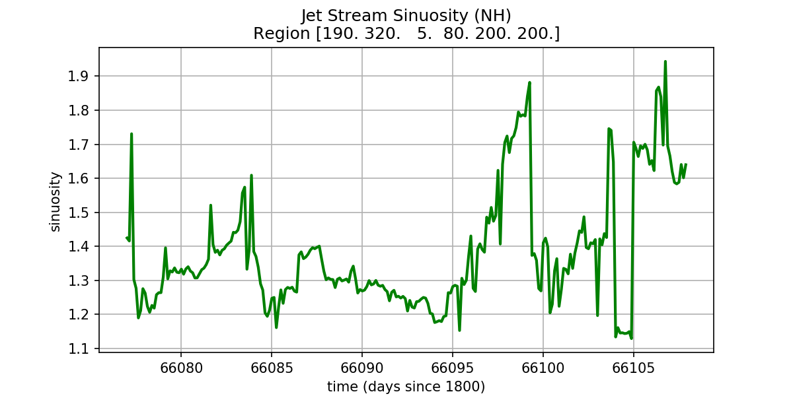

# Demo code computing sinuosity of the jet stream
The purpose of this demo is to illustrate how to extend TECA for a non-trivial
use case and how to load and post process data produced. The demo makes use of
a number of existing TECA algorithms (teca_cf_reader, teca_l2_norm,
teca_binary_segmentation, teca_connected_components, teca_2d_component_area,
teca_component_area_filter, teca_topological_spine, teca_jet_stream_sinuosity,
teca_table_reduce, teca_table_sort, teca_table_calendar, teca_table_writer) and
2 new customized algoritghms written in Python (teca_topological_spine.py,
teca_jet_stream_sinuosity.py). The demo comes with a command line application
(teca_jet_stream_sinuosity) that constructs and runs the pipeline. A second
script (plot_sinusoty.py) illustrates how to read in the resulting table and
access the data. This demo has been tested with TECA version 3.0.0.

## Segmentation and topological spine

We use a binary segmentation of wind speed(30 m/s) high in the atmosphere(200
hPa) followed by a medial axis transform followed by a pruning step to compute
a topological spine of the jet stream. In the above figure the segmentation is bound by black
lines, wind speed is shown by pseudocolor, and topological spine is shown as a
green line in the northern hemisphere and a blue line in the southern hemisphere.

## Sinuosity

We compute the sinuosity by dividing the length along the topological spine by
the length of an arc of parallel latitude between the most westerly and easterly
longitude at the mean latitude.
Length along the spine is calculated using Vincenty's formula for great
circle distance. In the above figure the green line shows the spine and the
yellow line shows the distance between westerly and easterly points.

## Result

The command line application runs in parallel and produces a table of sinuosity
with a row for northern hemisphere and southern hemisphere for each step in the
input dataset. A second app can be used to load this table and plot the
results as shown in the above figure.

## How to run the code
On cori the code can be run using the included `run_demo_cori.sh` script on a compute node.

```bash
mpiexec -np 10 ./teca_jet_stream_sinuosity \
    --input_regex=/home/bloring/work/teca/jet_stream_data/cam5_1_amip_run2'.*\.nc'  \
    --output_file=sinuosity.bin --area_threshold 7.e6

python plot_sinuosity.py sinuosity.bin sinuosity.png
```
