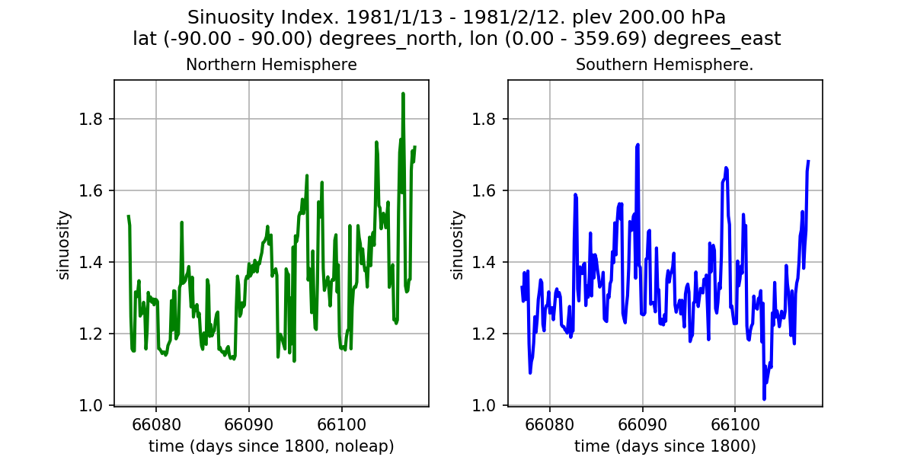

# Demo code computing sinuosity of the jet stream
The purpose of this demo is to illustrate how to extend TECA for a non-trivial
use case and how to load and post process data produced. The demo makes use of
a number of existing TECA algorithms (teca_cf_reader, teca_l2_norm,
teca_binary_segmentation, teca_connected_components, teca_2d_component_area,
teca_component_area_filter, teca_topological_spine, teca_jet_stream_sinuosity,
teca_table_reduce, teca_table_sort, teca_table_calendar, teca_table_writer) and
2 new customized algoritghms written in Python (teca_topological_spine.py,
teca_jet_stream_sinuosity.py). The demo comes with a command line application
(teca_jet_stream_sinuosity) that constructs and runs the pipeline. A second
script (plot_sinusoty.py) illustrates how to read in the resulting table and
access the data. This demo has been tested with TECA version 3.0.0.

## Segmentation and topological spine

We use a binary segmentation of wind speed(30 m/s) high in the atmosphere(200
hPa) followed by a medial axis transform followed by a pruning step to compute
a topological spine of the jet stream. The segmentation is bound by black
lines, wind speed is shown by pseudocolor, and topological spine is shown as a
green line.

## Sinuosity defined

We compute the sinuosity by dividing the length along the topological spine by
the length between it's most easterly and westerly points. Ties in the
end-points are resolved by taking the longer length between most easterly and
westerly points. Lengths are calculated using Vincenty's formula for great
circle distance.

## Result

The command line application runs in parallel and produces a table of sinuosity
with a row for northern hemisphere and southern hemisphere for each step in the
input dataset. A second app can be used to load this table and plot the
results.

## How to run the code

```bash
mpiexec -np 10 ./teca_jet_stream_sinuosity \
    --input_regex=/home/bloring/work/teca/jet_stream_data/cam5_1_amip_run2'.*\.nc'  \
    --first_step=0 --last_step=-1  --output_file=tut_demo_30/sinuosity.bin \
    --output_image=tut_demo_sub/tut_demo_30 --dpi=150 --area_threshold 7.e6

python plot_sinuosity.py tut_demo_30/sinuosity.bin tut_demo_30/sinuosity.png
```
